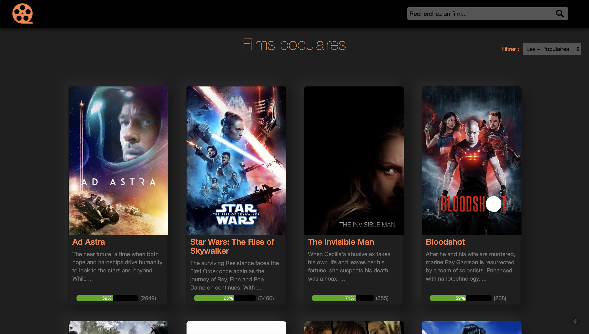
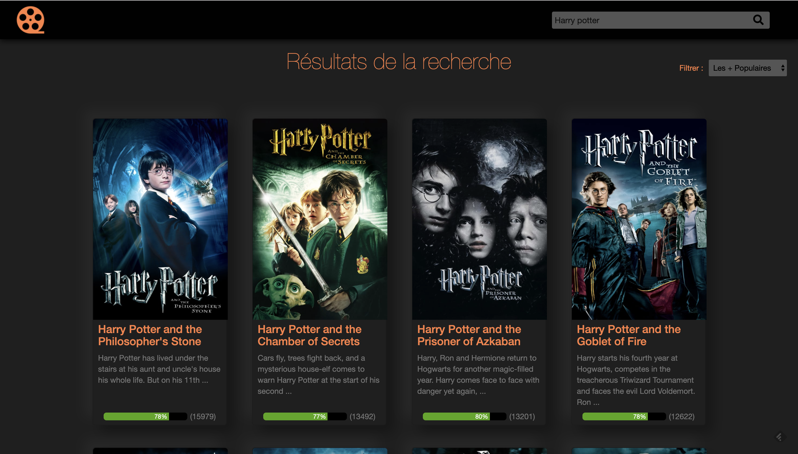
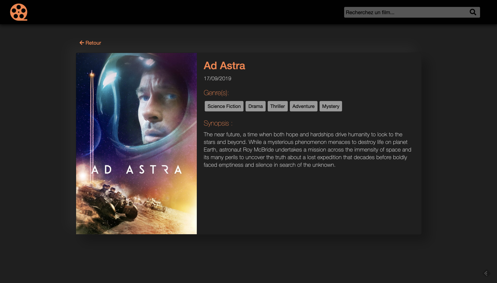

# Cinéma desktop app avec Angular JS

Le but de ce projet était l'apprentissage d'Angular JS en suivant [ce cours OpenClassroom](https://openclassrooms.com/fr/courses/2516051-developpez-vos-applications-web-avec-angularjs/2531801-presentation-du-projet). Il m'a permis de me familiariser avec les notions de base d'Angular (controlleurs, directives & services) et même de créer une directive et un service personnalisés. J'ai également eu l'occasion de me perfectionner en Node JS ainsi qu'avec la gestion des API.

## Technologies utilisées :

- Angular JS
- Yeoman
- Grunt
- Bower

- The movie db API

- Node JS pour le serveur

## Fonctionnalités implémentées

- **Service** de requêtes ajax afin de réaliser toutes les opérations sans recharger la page

- **Directive** "loading" qui affiche une icone lors des chargements

- Liste des films populaires -> **Controller "popular"**
    - Affichage en **carte** clickable
    - Barre de progression des notes
    - Pagination automatique avec **Angular Bootstrap UI**
    - Tri des résultats grâce aux filtres d'Angular

- Recherche de films -> **Controller "search" & "header"**
    - Même template que pour les films populaires
    - Tri des résultats possible également
    - Pagination automatique

- Affichage des détails du film sélectionné -> **Controller "info"**
    - Requête AJAX pour récupérer les informations

## Screenshots 

